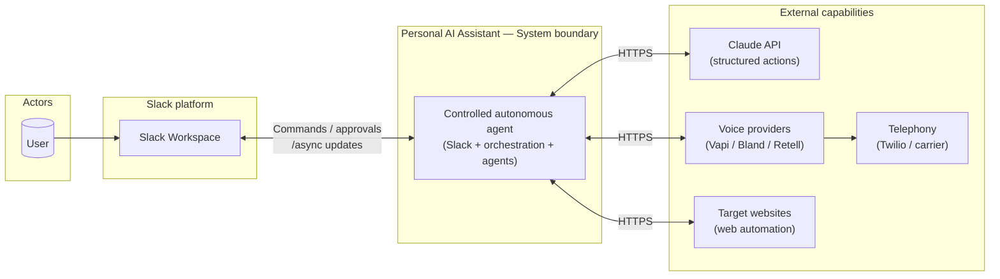
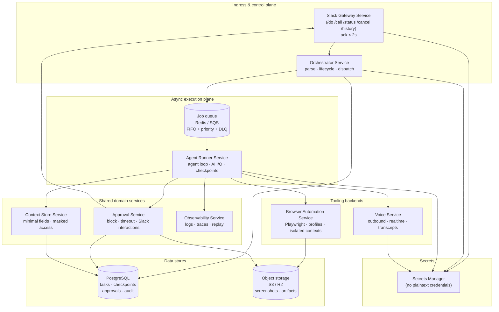
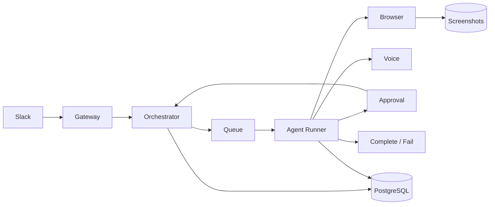
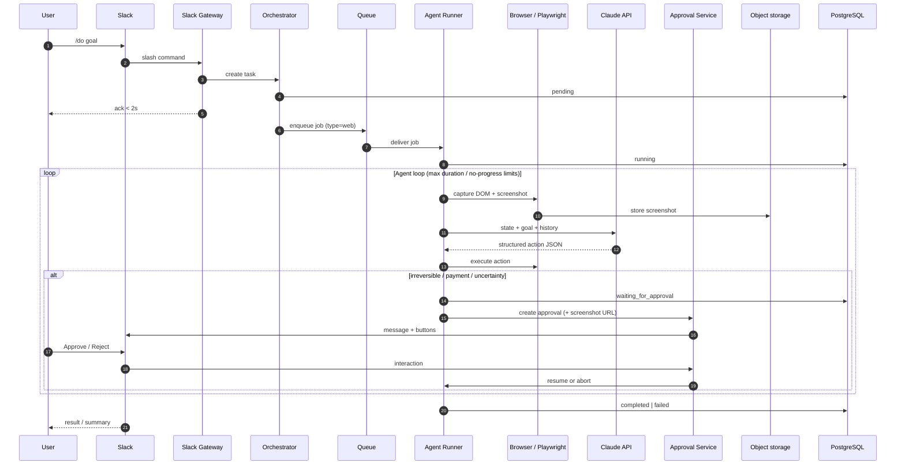
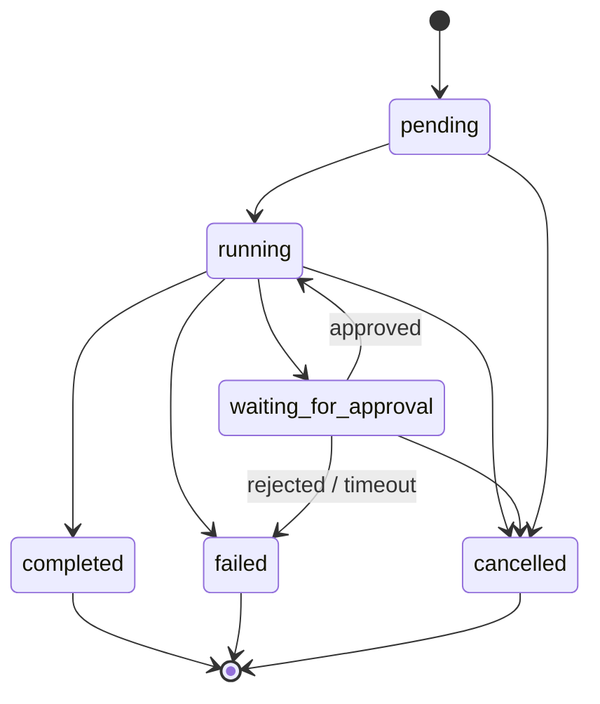
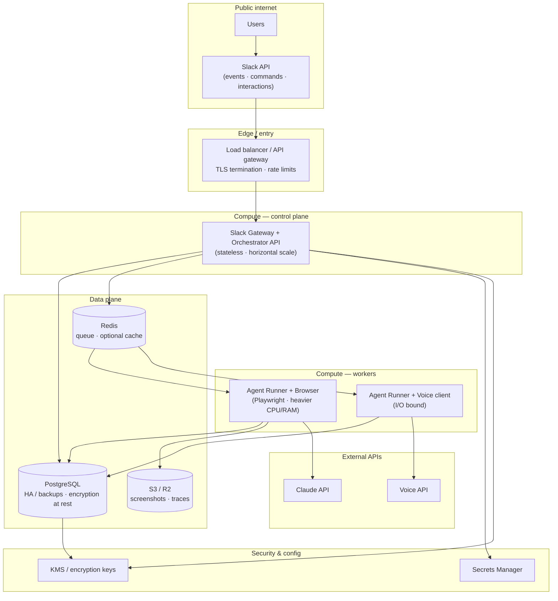
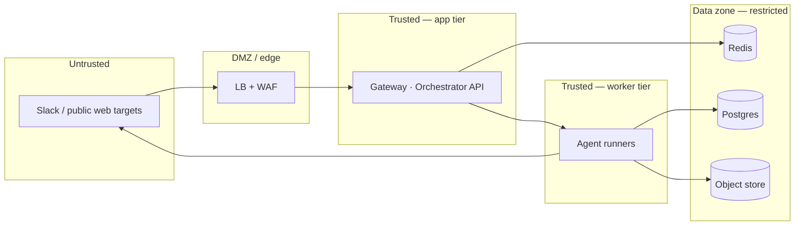
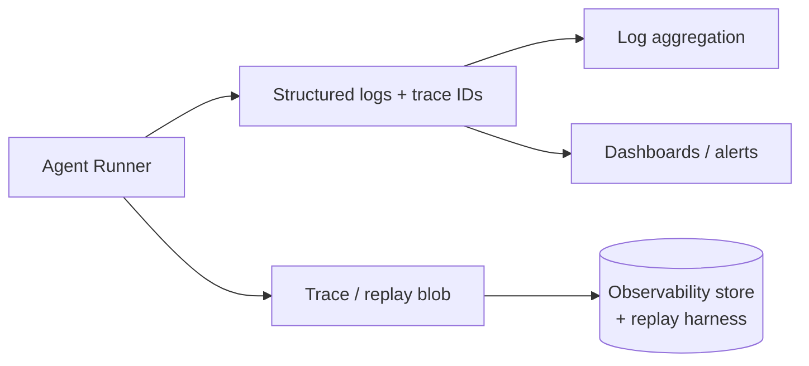

# System Architecture — Visual Reference

**Source:** `docs/product-prd.md` v3.0 · **Planning:** `planning/epics.md`, `planning/phases.md`

This document provides **logical** and **infrastructure** views. Diagrams use [Mermaid](https://mermaid.js.org/) (renders in GitHub, GitLab, many IDEs, and Markdown preview).

---

## 1. System context (C4 Level 1)

Who interacts with the system and which external systems are involved.

---

## 2. Logical service architecture (C4 Level 2 — containers)

Mandatory modular services from the PRD, plus queue and persistence.

---

## 3. Runtime data flow (primary path)

PRD §2.3: Slack → Gateway → Orchestrator → Queue → Agent Runner → (Browser | Voice) → Approval → Completion.

---

## 4. Sequence — `/do` web task with approval checkpoint

Illustrates blocking approval, screenshot URL, and resume.

---

## 5. Task lifecycle (strict states)

---

## 6. Infrastructure & deployment topology

Logical cloud layout: **API / gateway** path vs **worker** path vs **data plane**. Adjust regions and HA for your provider.

---

## 7. Network trust zones (conceptual)

Useful for firewall rules and least-privilege IAM.

---

## 8. Observability path

PRD §12: log actions, AI I/O, screenshots; support replay/debug.

---

## Related documents

| Document | Purpose |
|----------|---------|
| `docs/product-prd.md` | Authoritative requirements |
| `planning/epics.md` | Epic breakdown |
| `planning/phases.md` | Delivery phases |
| `planning/dependencies.json` | Task graph |

---

## Export tips

- **PNG/SVG from Mermaid:** use [Mermaid Live Editor](https://mermaid.live), CLI `mmdc`, or IDE export.
- **Diagrams as Code:** keep this file as the source of truth; regenerate images in CI if needed.
